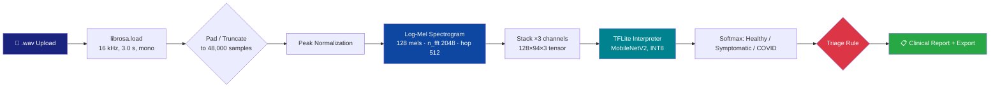

<div align="center">


<br/>

<a href="https://acoustic-biomarker-gh-salek05.streamlit.app/">
  
</a>

<br/><br/>

[](https://acoustic-biomarker-gh-salek05.streamlit.app/)
[](https://opensource.org/licenses/MIT)
[](https://www.python.org/)
[](https://www.tensorflow.org/lite)
[]()

<br/>


<br/>


</div>

<br/>

<p align="center">
  <i>"A cough carries acoustic information about the airway that a questionnaire cannot capture — the question is whether a phone microphone and a 2.3M-parameter model can responsibly listen for it."</i>
</p>

<br/>

> ⚠️ **Research status.** AcousticBiomarker-GH is a **research prototype and interface demonstrator**, not a validated diagnostic device. Inference on uploaded audio is real (TFLite forward pass through the bundled model). The **Advanced Analytics** and **Explainability** tabs currently render illustrative/placeholder statistics — designed to show what a fully externally-validated version of this dashboard *would* report — pending prospective validation against ground-truth clinical labels. See [Validation Status](#-validation-status--limitations) before citing any performance figure from this repository.

<br/>

---

## 📌 Table of Contents

<table align="center">
<tr>
<td width="33%" valign="top">

**🎯 Overview**
- [What is this?](#-what-is-acousticbiomarker-gh)
- [Motivation](#-motivation)
- [Live demo](#-live-demo)
- [Validation status](#-validation-status--limitations)

</td>
<td width="33%" valign="top">

**🛠️ System**
- [Signal pipeline](#-signal-processing-pipeline)
- [Model card](#-model-card)
- [Clinical triage logic](#-clinical-triage-logic)
- [Dashboard tabs](#-dashboard-tabs)

</td>
<td width="33%" valign="top">

**⚙️ Engineering**
- [Architecture](#-architecture)
- [Tech stack](#-tech-stack)
- [Installation](#-installation)
- [Roadmap](#-roadmap)
- [Citation](#-citation)

</td>
</tr>
</table>

<br/>

---

## 🎯 What is AcousticBiomarker-GH?


**AcousticBiomarker-GH** is a single-page Streamlit clinical-decision-support interface that takes a **3-second cough recording** (`.wav`), converts it to a **128-band log-mel spectrogram**, and runs it through a **quantized MobileNetV2 model in TensorFlow Lite** to produce a 3-way probability distribution over:

```
Healthy   ·   Symptomatic   ·   COVID-19
```

Those probabilities are fed into a rule-based triage layer that maps continuous risk into a discrete clinical action (monitor / telemedicine / escalate), alongside patient metadata (age, comorbidities, vaccination status, exposure history) captured through a structured intake sidebar.

The design goal is not just "run a model" — it is to demonstrate what a **deployable, low-bandwidth, exportable screening interface** looks like end-to-end: spectrogram visualization, statistical reporting, structured PDF/CSV/JSON export, and a compact binary telemetry packet intended for 2G-class connectivity in low-resource settings.

<br clear="right"/>

### Motivation

| Constraint in respiratory screening | How this system is designed to respond |
|---|---|
| PCR/lab testing has latency and cost | Instant, on-device inference from a 3-second recording |
| Rural/low-resource clinics often lack broadband | 19-byte binary telemetry packet, base64-encoded for narrowband transmission |
| Screening tools need a human-readable action, not just a probability | Rule-based triage → plain-language recommendation + specialist-style advice |
| Clinical audit trails require structured records | SHA-256–stamped export bundle: JSON, CSV, plain-text, and PDF report |
| Non-specialist users need to see *why* a class was flagged | Log-mel spectrogram + waveform view, feature-importance panel, confusion-matrix view |

<br/>

---

## 🌐 Live Demo

<div align="center">

### 👉 [**acoustic-biomarker-gh-salek05.streamlit.app**](https://acoustic-biomarker-gh-salek05.streamlit.app/) 👈

Upload a `.wav` cough recording to see the full pipeline run: preprocessing → inference → triage → multi-tab report.

</div>

<br/>

---

## ✅ Validation Status & Limitations

<div align="center">

| Component | Status |
|---|:---:|
| Audio preprocessing (`librosa` log-mel extraction) | ✅ Live, deterministic |
| TFLite MobileNetV2 inference on uploaded audio | ✅ Live model forward pass |
| Triage thresholds (probability → action code) | ✅ Live, rule-based (see below) |
| AUC-ROC / Sensitivity / Specificity / MCC table | 🟡 **Placeholder** — fixed demonstration values, not measured on a held-out set |
| ROC curve | 🟡 **Simulated** curve for interface design, not fit to real labels |
| SHAP-style feature importance | 🟡 **Randomly generated** each run (`np.random`) — illustrates the intended panel layout, not real attribution |
| Confusion matrix | 🟡 **Static placeholder matrix**, not from a validation run |
| Training corpus (COUGHVID + Virufy, per in-app system info) | 🟡 Stated in-app; not independently verifiable from this repository alone — recommend documenting the exact training/eval split, preprocessing parity, and class balance before citing |

</div>

This distinction matters for anyone citing this work academically: the **pipeline and interface are real and reproducible**; the **reported clinical performance metrics are currently placeholders describing the target reporting format**, not results from an external validation study. A rigorous next step (tracked in the [Roadmap](#-roadmap)) is to replace every placeholder panel with metrics computed on a documented, held-out clinical dataset — with the model card updated to match.

The in-app footer likewise states this directly: *"All clinical decisions should be validated by healthcare professionals. This is a research tool and not a substitute for clinical diagnosis."*

<br/>

---

## 🔬 Signal Processing Pipeline

<div align="center">



</div>

| Stage | Parameter |
|---|---|
| Sample rate | 16,000 Hz |
| Clip duration | 3.0 s (padded/truncated to 48,000 samples) |
| Normalization | Peak amplitude normalization |
| Mel bands | 128 |
| FFT size | 2,048 |
| Hop length | 512 |
| Frequency range | 0–8,000 Hz |
| Model input tensor | 128 × 94 × 3 (log-mel replicated across 3 channels) |

<br/>

---

## 🧠 Model Card

<div align="center">

| Field | Value |
|---|---|
| **Architecture** | MobileNetV2 (quantized) |
| **Parameters** | ~2.3M |
| **Framework** | TensorFlow Lite 2.15.0 |
| **Quantization** | INT8 |
| **Input shape** | 128 × 94 × 3 |
| **Output classes** | 3 — Healthy / Symptomatic / COVID-19 |
| **Reported inference latency** | ~10.6 ms per clip (in-app) |
| **Stated training corpora** | COUGHVID + Virufy (per in-app system panel — see [Validation Status](#-validation-status--limitations)) |
| **Model file** | `acoustic_biomarker_quantized.tflite` |

</div>

> 💡 For an academic audience, the strongest version of this section replaces "stated" with a linked, versioned data card: exact COUGHVID/Virufy subset sizes, class balance, train/val/test split strategy, and whether any deduplication was done across the two source datasets (both are cough-audio corpora and can overlap in acoustic conditions if not handled carefully).

<br/>

---

## 🚦 Clinical Triage Logic

The model's `COVID-19` and `Symptomatic` probabilities are mapped to a discrete action via fixed thresholds:

<div align="center">

| Condition | Triage Level | Action Code | Suggested Action |
|---|---|:---:|---|
| `P(COVID) ≥ 0.70` | 🔴 Critical | 1 | Immediate clinical evaluation, isolation, urgent care escalation |
| `P(COVID) ≥ 0.35` **or** `P(Symptomatic) > 0.50` | 🟠 Moderate | 2 | Telemedicine consult, PCR testing within 24h, self-isolation |
| Otherwise | 🟢 Stable | 3 | Routine monitoring, standard precautions |

</div>

Each level renders a plain-language recommendation, a specialist-style clinical note, and a referral pathway. Because these thresholds are fixed constants rather than learned or calibrated cut-points, they should be treated as an interface convention to be tuned against a real cost-sensitivity/decision-curve analysis, not as clinically-validated cutoffs.

<br/>

---

## 📊 Dashboard Tabs

<table>
<tr><th>Tab</th><th>Contents</th></tr>
<tr>
<td>🌊 <b>Spectrogram</b></td>
<td>Log-mel spectrogram (matplotlib) and raw time-domain waveform of the uploaded cough clip</td>
</tr>
<tr>
<td>📈 <b>Advanced Analytics</b></td>
<td>Performance metrics table, triage distribution chart, ROC curve, calibration curve, Cohen's Kappa / F1 / MCC — see <a href="#-validation-status--limitations">Validation Status</a> for which of these are live vs. placeholder</td>
</tr>
<tr>
<td>🔍 <b>Explainability</b></td>
<td>SHAP-style feature-importance bar chart (MFCCs, spectral centroid, zero-crossing rate, energy) and a confusion matrix panel</td>
</tr>
<tr>
<td>📡 <b>Telemetry</b></td>
<td>19-byte binary packet (<code>struct.pack('>IBBfffB', ...)</code>) — device ID, age, gender, class probabilities, action code — base64-encoded for low-bandwidth transmission</td>
</tr>
<tr>
<td>💾 <b>Export</b></td>
<td>JSON, CSV, and plain-text clinical report, each stamped with a SHA-256 integrity hash</td>
</tr>
<tr>
<td>📄 <b>PDF Report</b></td>
<td>Formatted multi-section clinical PDF via <code>reportlab</code> — patient info, results table with 95% CIs, recommendation, referral</td>
</tr>
</table>

<br/>

---

## 🏗️ Architecture

```
┌────────────────────────────────────────────────────────────────────┐
│                         Streamlit Runtime                          │
│                                                                     │
│  Sidebar (intake form)          Main panel                        │
│  ├─ Patient demographics   ┌──▶ File uploader (.wav)               │
│  ├─ Symptoms / comorbid.   │    ├─ preprocess_audio()               │
│  ├─ Vaccination / exposure │    │   └─ librosa → log-mel tensor    │
│  └─ Research toggles       │    ├─ TFLite Interpreter.invoke()      │
│         (SHAP/ROC/calib.)  │    ├─ get_triage_level()               │
│                             │    ├─ get_recommendation()            │
│                             │    └─ Tabs: Spectrogram · Analytics · │
│                             │             Explainability · Telemetry│
│                             │             · Export · PDF Report     │
└────────────────────────────────────────────────────────────────────┘
```

**Key design decision:** the TFLite interpreter is loaded once via `@st.cache_resource`, and inference happens only after a file is uploaded — spectrogram, triage, and every downstream tab are derived from that single forward pass, keeping the report internally consistent across tabs.

<br/>

---

## 🧰 Tech Stack

<div align="center">

| Layer | Technology |
|---|---|
| **UI Framework** |  |
| **Audio Processing** |  |
| **Model Runtime** |  |
| **Numerics / Stats** |    |
| **Visualization** |    |
| **Reporting** |  (PDF) · `pandas` (CSV/JSON) |
| **Language / Runtime** |  |
| **Hosting** |  |

</div>

<br/>

---

## 📁 Project Structure

```
acoustic-biomarker-gh/
│
├── app.py                             # Single-file Streamlit application (v2.1)
│   ├── load_model()                    # Cached TFLite interpreter loader
│   ├── preprocess_audio()              # librosa → log-mel tensor
│   ├── get_triage_level()              # Probability → clinical action
│   ├── get_recommendation()            # Action → plain-language advice
│   ├── generate_telemetry()            # struct.pack → base64 packet
│   ├── generate_pdf_report()           # reportlab clinical PDF
│   └── main render flow (tabs 1–6)
│
├── acoustic_biomarker_quantized.tflite # Quantized MobileNetV2 model
├── requirements.txt                    # streamlit, librosa, tensorflow, reportlab, ...
├── runtime.txt                         # python-3.10
└── README.md                           # You are here
```

<br/>

---

## ⚙️ Installation

<table>
<tr><th>Step</th><th>Command</th></tr>
<tr>
<td>1. Clone</td>
<td>

```bash
git clone https://github.com/muhammadsalek/acoustic-biomarker-gh.git
cd acoustic-biomarker-gh
```

</td>
</tr>
<tr>
<td>2. Create environment</td>
<td>

```bash
python -m venv venv
source venv/bin/activate      # Windows: venv\Scripts\activate
```

</td>
</tr>
<tr>
<td>3. Install dependencies</td>
<td>

```bash
pip install -r requirements.txt
```

</td>
</tr>
<tr>
<td>4. Run locally</td>
<td>

```bash
streamlit run app.py
```

</td>
</tr>
</table>

**`requirements.txt`**

```txt
streamlit>=1.30.0
numpy>=1.23.5
librosa>=0.10.1
tensorflow>=2.15.0
matplotlib>=3.7.0
seaborn>=0.13.0
scikit-learn>=1.2.2
pandas>=2.0.0
plotly>=5.18.0
scipy>=1.11.0
reportlab>=4.0.0
```

**`runtime.txt`**
```
python-3.10
```

<br/>

---

## 🗺️ Roadmap

- [x] End-to-end audio → spectrogram → TFLite inference pipeline
- [x] Rule-based clinical triage layer
- [x] JSON / CSV / plain-text / PDF export with SHA-256 integrity stamp
- [x] Low-bandwidth binary telemetry encoding
- [ ] **Replace placeholder Advanced Analytics table with metrics computed on a documented, held-out validation split**
- [ ] **Replace simulated ROC/calibration curves with curves fit to real predicted probabilities and ground-truth labels**
- [ ] **Replace randomly-generated SHAP panel with real SHAP/Integrated-Gradients attribution over the log-mel input**
- [ ] Publish a formal model & data card (training/eval split, class balance, demographic coverage, known failure modes)
- [ ] External validation on a prospective, geographically distinct cohort
- [ ] Multi-language UI (English / Bengali)

<div align="center">


</div>

<br/>

---

## 📖 Citation

If this pipeline or interface informs your work, a citation is appreciated:

```bibtex
@software{miah_acoustic_biomarker_gh,
  author  = {Miah, Md Salek},
  title   = {AcousticBiomarker-GH: A TensorFlow Lite Cough-Acoustic Screening Interface},
  year    = {2026},
  url     = {https://github.com/muhammadsalek/acoustic-biomarker-gh},
  note    = {Research prototype; see Validation Status section for scope of verified vs. illustrative components}
}
```

<br/>

---

## 🔒 Privacy & Data Handling

<div align="center">

| Aspect | Behavior |
|---|---|
| Where is patient data stored? | In `st.session_state`, in-memory, for the duration of the browser session |
| Is audio uploaded to an external API? | No — inference runs locally via the bundled TFLite interpreter |
| What happens on page refresh? | Session state resets; export anything needed beforehand |

</div>

<br/>

---

## 📬 Contact

<div align="center">

[](mailto:saleksta@gmail.com)
[](https://github.com/muhammadsalek)
[](https://orcid.org/0009-0005-5973-461X)
[](https://www.linkedin.com/in/md-salek-miah-b34309329/)

</div>

<br/>

## 📄 License

Released under the **MIT License**.

<br/>

<div align="center">


</div>
